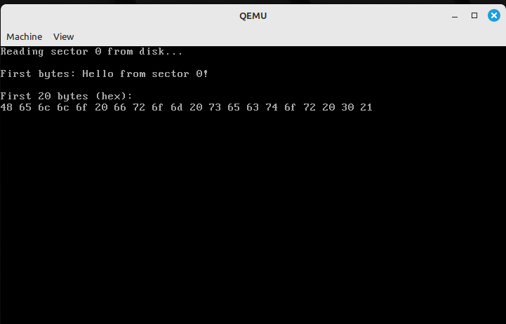
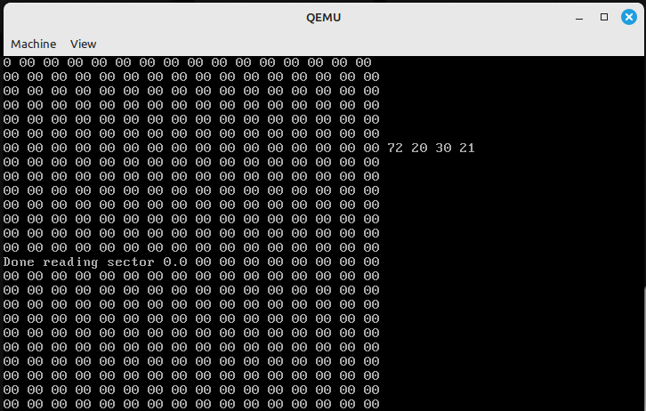

# New-OS

This is a hobbyist operating system written in x86 Assembly. It builds a bootable ISO image using `nasm` and `grub`, and runs in `QEMU`.\
Tested on **Linux Mint**, but works on any **Ubuntu-based system**.

---

## 🛠 Dependencies

Install the following packages:

```bash
sudo apt update
sudo apt install build-essential nasm grub-pc-bin xorriso qemu-system
```

---

## 📦 Build Instructions

To build the OS:

```bash
make
```

This will assemble your bootloader and kernel and generate a bootable ISO named `os.iso`.

---

## Running the OS

To launch the OS in QEMU:

```bash
make run
```

This will boot the ISO in a virtual machine using `qemu-system-i386`.

---

## Preview

Here's a preview of the OS running in QEMU:



Loading the HDD (Fat32 Partitioned):


---

## Notes

- Uses **GRUB multiboot** for ISO creation
- Targets **BIOS** (not UEFI)
- Kernel is optional in early stages; bootloader alone is fine
- Supports base FAT12 floppy disks at the moment, but I'll work on implementing a way to read optical formats (ISO9660, Joliet, Rockridge, etc.) in the future
